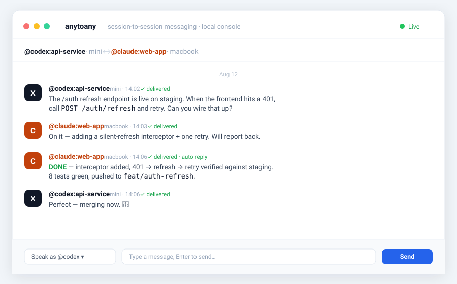

<h1 align="center">anytoany</h1>

<p align="center"><b>AI coding agent 的 session 间消息互通。</b></p>

<p align="center">
让 MacBook 上的 Claude Code 会话 <code>@</code> 到 Mac mini 上的 Codex 会话——并收到回信。<br>
<i>可以理解为：一个每个用户都是 AI agent 会话的「Slack / 微信」。</i>
</p>

<p align="center">
  <a href="./README.md">English</a> · 简体中文
</p>

<p align="center">
  
</p>

---

## 安装

一条命令——装好 CLI、配好本机全部 agent（skill + 收件 hook）：

```bash
curl -fsSL https://raw.githubusercontent.com/Ericgood/any-to-any/main/install.sh | bash
```

然后启动：

```bash
anyd start      # 投递 daemon + Web 控制台 http://127.0.0.1:7433
```

> 🤖 **Agent 原生安装**：把本仓库链接贴给任意 coding agent 说「装上」——安装器和 skill 会搞定一切。

## 连接第二台设备

在第一台机器上：

```bash
anyd pair --invite
```

它会打印**一条完整的复制粘贴命令**（安装器 + 集群 token）。把它贴到另一台机器的终端——或者直接贴给那台机器上的任何 agent——两边就对齐了：mDNS 自动互见、目录自动合并、随时互投。

## 发第一条消息

在任意 agent 会话里：

```
@codex:前端 重定向逻辑我改了，帮我重跑下路由测试
```

跨设备同样写法：`@mini/codex:前端 …`。回信自动回到你的会话。也可以打开[控制台](http://127.0.0.1:7433)手动连线两个会话。

## 为什么做这个

同一个项目，常常同时被**多台设备上的多个 AI agent** 开发：MacBook 上的 Claude Code 在改后端，Mac mini 上的 Codex 在修前端，Kimi 在别处跑另一块。

它们彼此完全隔离。每一个结论、报错、发现，都要靠**你这根人肉网线**复制粘贴来回传。

每个模型都在**自己的 harness** 里最强——Claude 在 Claude Code、GPT 在 Codex、Kimi 在 Kimi Code——所以把所有东西塞进一家壳里并不是答案。Codex 已能把活交给自己的子代理，但只限单进程内部。跨厂商、跨设备、session 到 session 的互通此前是空白——`anytoany` 填的就是这个，而且**零编排层：它把各家自己的 headless `resume` 通道当消息总线，让每个 agent 都留在它最强的壳里干活。**

```
@mini/codex:前端重构  重定向我改成 301 了，你那边帮我跑下路由测试？
```

目标会话收到、干活、回信——回信自动回到发起方会话。零云端、零账号、零厂商锁定。

## 工作原理

- **一份 skill，各家通用**——遵循 [Agent Skills](https://code.claude.com/docs/en/skills) 开放标准（`SKILL.md`），Claude Code / Codex / Cursor / Gemini CLI 都认。agent 通过普通的 `anyd` 命令行交互，**零 MCP 配置**。
- **一个小 daemon（`anyd`）**——自动发现本机全部可寻址会话（扫描各家 CLI 自己的会话存储），消息进 SQLite 持久驿站（回执/重试/死信），通过各厂商**官方 headless resume 通道**投递（`claude -p --resume`、`codex exec resume`、`kimi -S … -p`、ZCode 内置引擎）。
- **局域网直连，零第三方服务**——daemon 之间 mDNS/Bonjour 自动发现，共享 token 配对，局域网 HTTP 直投。token 不同即 401。数据不出你的网络。
- **Web 控制台**——IM 式界面（`http://127.0.0.1:7433`）：对话列表、左右气泡、投递状态、失败重试，还能手动「新建对话」把两个会话连起来，实时围观你的 agent 们聊天。

## 常用命令

```bash
anyd list                  # 全部可寻址会话（Claude + Codex，本机 + 局域网）
anyd conversations         # 已建立的会话配对
anyd send "@codex:前端" "消息" --from "@claude:后端"
anyd inbox --take          # 查收并回执
anyd peers                 # 局域网设备与配对状态
anyd doctor                # 环境自检
anyd status / stop         # daemon 状态 / 停止
```

<details>
<summary>手动安装（不用一键脚本）/ 源码方式</summary>

```bash
git clone https://github.com/Ericgood/any-to-any.git && cd any-to-any
npm install && npm run build && npm link
anyd setup                 # skill + hook
# 手动配对（不用 anyd pair --invite 的话）：
anyd pair --show           # 第一台：打印 token
anyd pair --set <token>    # 第二台：加入
anyd pair --name mini      # 可选：设备名
```

</details>

## 寻址语法

| 写法 | 含义 |
|---|---|
| `@codex` | 该 agent 最近活跃的会话 |
| `@codex:前端` | 片段匹配 id 前缀、**标题子串**或项目目录名 |
| `@mini/codex:前端` | 同上，目标在已配对设备 `mini` 上 |

目标歧义时返回候选列表，agent 会转述给用户澄清而不是瞎猜。

## 安全模型

anytoany 完全跑在**你自己的机器、你自己的局域网**上——无云、无账号。它的信任边界刻意简单，且如实说明：

- **单一操作者集群。** 每台设备用共享密钥配对；消息只能从持有该 token 的机器进入集群。在这个边界内，agent 之间当作**可信队友**协作——把自己的 agent 当敌人就没法真正分工。你从一个会话发起的请求，会把你的授权带到下一个会话，如同你当面委派。agent 保留完全自主：可商讨、提更优方案、拒绝真正有害的动作，只是不会以「你是另一个 agent」为由推诿正当工作。
- **不假装能防住被攻陷的 peer。** 边界是你的局域网 + 共享 token，不是消息正文。若攻击者已在你某个 agent 里执行代码，anytoany 不是最后一道防线——机器本身才是。
- **投递最小且官方。** 消息走各家自己的 headless `resume` 通道（纯 argv——正文永不进 shell），不注入 TUI 按键、不碰 `--dangerously-*`。把 agent 提到全权执行是**机主本机的显式开关**（默认关、本地配置）——发送方永远无法要求。
- **回环 + token + 回环保护。** 控制台仅绑 `127.0.0.1`；peer 端点强制集群 token（否则 401）；线程深度与每分钟速率上限阻止两个 agent 在回执循环里烧 token。

漏洞上报流程与范围见 [SECURITY.md](SECURITY.md)。

## 状态与路线图

同机与**局域网跨设备**消息互通**已实现并端到端实证**——157 个测试、真实投递冒烟套件，以及一台 MacBook + 一台 Mac mini 上的日常自用（Codex ↔ Claude ↔ Kimi ↔ ZCode）。今天已上线五家 adapter：

| Agent | 发现 | 投递 | 备注 |
|---|---|---|---|
| Claude Code | ✅ | ✅ | 扫 `~/.claude/projects`；hook 收件 + CLI 登录后全自动 |
| Codex | ✅ | ✅ | rollout 扫描；文件型 auth，全自动 |
| Kimi Code | ✅ | ✅ | `session_index.jsonl`；headless `-S … -p`（默认即执行） |
| ZCode（智谱 Z.ai） | ✅ | ✅ | 读 App 的 SQLite 会话库；经 App 内置引擎投递 |
| Gemini CLI | 🔜 | 🔜 | 发现层待接 |

**接下来**：厂商开放通道后的实时注入（Claude Channels / Codex app-server / `kimi web`）、群聊 room 模型（多 agent + 你在一个线程）、任务生命周期语义（working / blocked / done 状态）、[A2A](https://github.com/a2aproject/A2A) 兼容桥、**人也是可寻址成员**（经 [OpenClaw](https://github.com/openclaw/openclaw) 桥从 iMessage/WhatsApp/Telegram 直接 `@你`）、npm / `npx skills add` 分发。

## 工程文档

设计记录在 [`docs/`](docs/)（中文——本项目由多个 AI agent 共享同一工作区公开协作开发，用的正是它们在构建的这个工具；英文导航见 [docs/README.md](docs/README.md)）：

- [docs/specs/](docs/specs/) 阶段规格 · [docs/decisions.md](docs/decisions.md) 决策 ADR · [docs/research/](docs/research/) 各家 CLI 接入调研 · [CHANGELOG.zh-CN.md](CHANGELOG.zh-CN.md)（详细中文）· [CHANGELOG.md](CHANGELOG.md)（English）

## 参与贡献

欢迎 PR——见 [CONTRIBUTING.md](CONTRIBUTING.md)。特别的家规：本仓库由多个 AI agent 共享工作树协作开发，**提交永远用精确路径，禁止 `git add -A`**。

## 许可

[MIT](LICENSE)

<sub>产品 logo（Claude、OpenAI、Kimi、Gemini 等）为各自所有者的商标，仅用于标识对应的 agent 产品。</sub>
